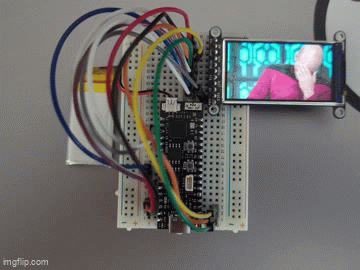
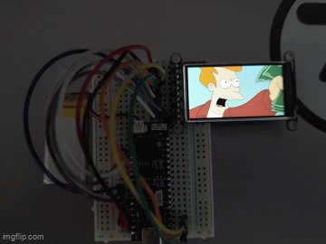
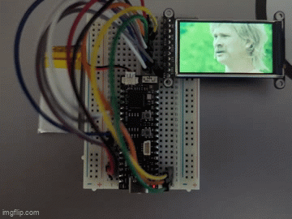
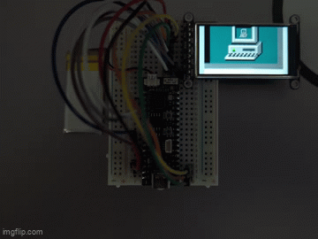

# GIFPlayer (ProS3 + ST7789 170x320)

Desk-toy firmware that plays random GIF animations on a **170x320 ST7789 TFT** using **LovyanGFX** + **AnimatedGIF**.

It prefers GIFs from an **SD card** (FAT) when inserted, and falls back to **SPIFFS** if no SD GIFs are found.

## Demo

<p float="left">
  
  
</p>
<p float="left">
  
  
</p>

## Hardware

### Display (ST7789, SPI)

These are the default pins in `src/lgfx_pros3_st7789_170x320.hpp`:

- **SCK**: GPIO **36**
- **MOSI**: GPIO **35**
- **MISO**: (TFT write-only) set to `-1` unless shared with SD
- **CS**: GPIO **4**
- **DC**: GPIO **5**
- **RST**: GPIO **2**
- **BL**: GPIO **14**

### SD card (SPI mode, shared bus)

The SD socket shares **SCK/MOSI/MISO** with the TFT.

- **SCK**: GPIO **36**
- **MOSI**: GPIO **35**
- **MISO**: GPIO **37** (set via `-D TFT_MISO=37` so the bus can read)
- **CS**: GPIO **15** (set via `-D SD_CS=15`)

**Note on CS choice**: GPIO **3** is an ESP32‑S3 strapping pin, so it’s **not recommended** for SD CS unless you know what you’re doing and ensure CS is held high at boot. GPIO 15 is a safer default.

## Project layout

- `src/main.cpp`: app logic, SD mount, GIF discovery, RAM-buffered playback
- `src/lgfx_pros3_st7789_170x320.hpp`: LovyanGFX panel/bus config
- `gifs/`: content uploaded to SPIFFS via `uploadfs`

## Building and flashing (PlatformIO)

From the project root:

```bash
pio run -e um_pros3
pio run -e um_pros3 -t upload --upload-port /dev/cu.usbmodem1101
```

Optional (SPIFFS fallback GIFs):

```bash
pio run -e um_pros3 -t uploadfs --upload-port /dev/cu.usbmodem1101
```

## GIF source selection

On boot:

1. Mount SD at **`/sd`**
2. Scan **`/sd`** and **`/sd/gifs`** recursively for `.gif`
3. If none found, scan SPIFFS (`/` then `/gifs`)

The scanner ignores dotfiles (including macOS AppleDouble `._*.gif` sidecars).

## Playback behavior

- **Random selection** (avoids immediate repeats)
- **Each GIF loops 3 times**
- **SD contention avoidance**: each GIF is read fully into RAM before decoding, so the SD bus is idle during frame drawing

## Tuning

### SPI speeds

TFT SPI write speed is configured in `src/lgfx_pros3_st7789_170x320.hpp` (`cfg.freq_write`).

If you see corruption, reduce it (typical stable values are 40MHz, 26.7MHz, 20MHz).

### Wide GIF support

`AnimatedGIF` defaults to `MAX_WIDTH=480` on MCUs; this project overrides it to **1024** (see `platformio.ini`) so common 500px-wide web GIFs decode.

### Serial logging

Quiet by default. To enable verbose logs, set in `platformio.ini`:

```ini
-D GIFPLAYER_DEBUG=1
```

## TODO

- battery monitoring
- run tft from ldo2
- deep sleep (low battery or after time)

